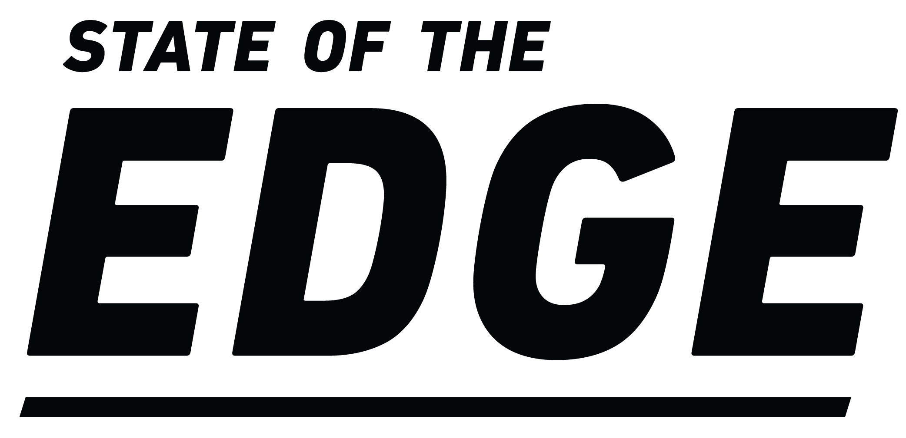

# LF Edge Related Logos and Artwork 
In this repo, we provide artwork in standard formats for the LF Edge [projects](https://www.lfedge.org/projects) and programs. We prepare artwork in 3 formats (PNG/SVG/AI), 3 layouts -- horizontal (also known as landscape format), stacked (which is closer to square), and icon (which does not include the name and is square), and 3 versions (color/black/white). So, that's at least 27 versions of most logos. 

## LF Edge Project Logos
      &nbsp;  &nbsp;  &nbsp; &nbsp;  &nbsp;  &nbsp; 

      &nbsp;  &nbsp;  &nbsp; &nbsp;  &nbsp;  &nbsp; 

 

      &nbsp;  &nbsp;  &nbsp;      &nbsp;  &nbsp;  &nbsp;     &nbsp;  &nbsp;  &nbsp;       &nbsp;  &nbsp;  &nbsp; 

 

      &nbsp;  &nbsp;  &nbsp; &nbsp;  &nbsp;  &nbsp; 

      &nbsp;  &nbsp;  &nbsp; 

      &nbsp;  &nbsp;  &nbsp; 

## LF Edge Logos

      &nbsp;  &nbsp;  &nbsp; &nbsp;  &nbsp;  &nbsp; 

## LF Edge Membership Badges

    &nbsp;  &nbsp;  &nbsp;         &nbsp;  &nbsp;  &nbsp;    

## LF Edge Landscape

      &nbsp;  &nbsp;  &nbsp; &nbsp;  &nbsp;  &nbsp; 

## 

Use of any trademark or logo is subject to the trademark policy available at https://www.linuxfoundation.org/trademark-usage.

If you have any questions, please email us at info@lfedge.org.
